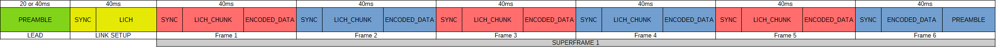
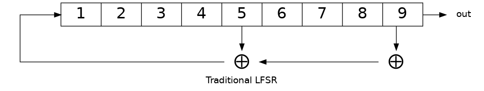
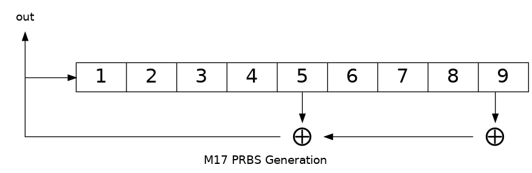
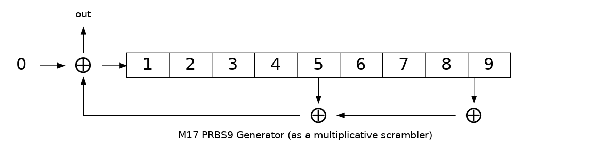
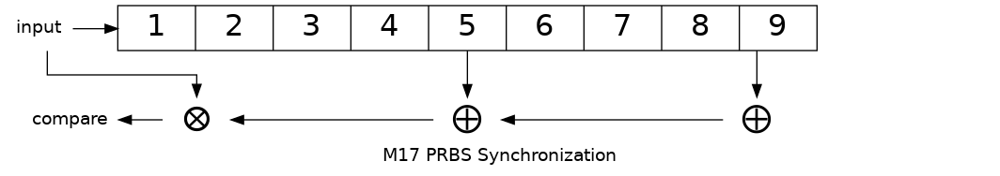
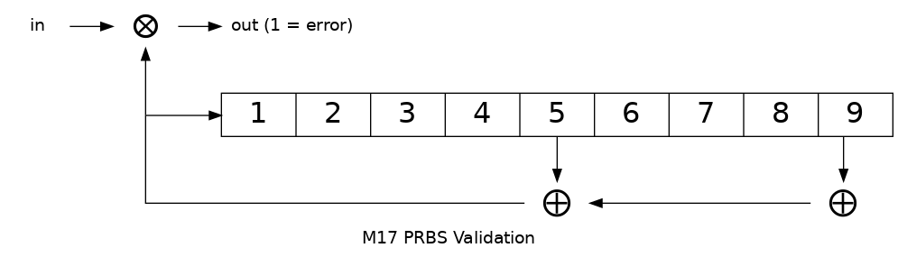

###############
Data Link Layer
###############
The Data Link layer is split into three modes:

* Packet mode
   Data are sent in small bursts, on the order of 100s to 1000s of bytes
   at a time, after which the physical layer stops sending data. e.g. messages, beacons, etc.

* Stream mode
   Data are sent in a continuous stream for an indefinite amount of time,
   with no break in physical layer output, until the stream ends. e.g. voice data,
   bulk data transfers, etc.

* BERT mode
   PRBS9 is used to fill frames with a deterministic bit sequence.  Frames are sent
   in a continuous sequence.

When the physical layer is idle (no RF being transmitted or received),
the data link defaults to packet mode. 

.. ~~To switch to stream mode, a
.. start stream packet (detailed later) is sent, immediately followed by
.. the switch to stream mode; the Stream of data immediately follows the
.. Start Stream packet without disabling the Physical layer. To switch
.. out of Stream mode, the stream simply ends and returns the Physical
.. layer to the idle state, and the Data Link defaults back to Packet
.. mode.~~

As is the convention with other networking protocols, all values are
encoded in big endian byte order.

Stream Mode
===========

In Stream Mode, an *indefinite* amount of payload data is sent continuously without breaks in the
physical layer. The *stream* is broken up into parts, called *frames* to not confuse them with *packets* sent
in packet mode. Frames contain payload data interleaved with frame signalling (similar to packets).
Frame signalling is contained within the **Link Information Channel (LICH)**.

Sync Burst
~~~~~~~~~~

All frames are preceded by a 16-bit *synchronization burst*.

    * Link setup frames shall be preceded with 0x55F7.
    * Stream frames shall be preceeded with 0xFF5D.
    * Packet frames shall be preceeded with 0x75FF.
    * BERT frames shall be preceeded with 0xDF55.

All syncwords are type 4 bits.

These sync words are based on `Barker codes`_.

.. _`Barker codes`: https://en.wikipedia.org/wiki/Barker_code

Link setup frame
~~~~~~~~~~~~~~~~

First frame of the transmission contains full LSF data. It’s called
the **Link Setup Frame (LSF)**, and is not part of any superframes.

.. list-table:: Link setup frame fields

   * - DST
     - 48 bits
     - Destination address - Encoded callsign or a special number (eg. a group)
   * - SRC
     - 48 bits
     - Source address - Encoded callsign of the originator or a
       special number (eg. a group)
   * - TYPE
     - 16 bits
     - Information about the incoming data stream
   * - META
     - 112 bits
     - Metadata field, suitable for cryptographic metadata like IVs or single-use numbers, or non-crypto metadata like the sender's GNSS position.
   * - CRC
     - 16 bits
     - CRC for the link setup data
   * - TAIL
     - 4 bits
     - Flushing bits for the convolutional encoder that do not carry any information. Only included for RF frames, not included for IP purposes.

.. list-table:: Bitfields of type field
   :header-rows: 1

   * - Bits
     - Meaning
   * - 0
     - Packet/stream indicator, 0=packet, 1=stream
   * - 1..2
     - Data type indicator, :math:`01_2` =data (D), :math:`10_2` =voice
       (V), :math:`11_2` =V+D, :math:`00_2` =reserved
   * - 3..4
     - Encryption type, :math:`00_2` =none, :math:`01_2` =AES,
       :math:`10_2` =scrambling, :math:`11_2` =other/reserved
   * - 5..6
     - Encryption subtype (meaning of values depends on encryption type)
   * - 7..10
     - Channel Access Number (CAN)
   * - 11..15
     - Reserved (don't care)

The fields in Table 3 (except TAIL) form initial LSF. It contains all
information needed to establish M17 link. Later in the transmission,
the initial LSF is divided into 6 "chunks" and transmitted
beside the payload data. This allows late-joiners to
reconstruct the LICH after collecting all the pieces, and start decoding
the stream even though they missed the beginning of the transmission.
The process of collecting full LSF takes 6 frames or 6*40 ms = 240
ms. Four TAIL bits are needed for the convolutional coder to go back to
state 0, so the ending trellis position is also known.

Voice coder rate is inferred from TYPE field, bits 1 and 2.

.. list-table:: Voice coder rates for different data type indicators
   :header-rows: 1

   * - Data type indicator
     - Voice coder rate
   * - :math:`00_2`
     - none/reserved
   * - :math:`01_2`
     - no voice
   * - :math:`10_2`
     - 3200 bps
   * - :math:`11_2`
     - 1600 bps

Subsequent frames
~~~~~~~~~~~~~~~~~

.. list-table:: Fields for frames other than the link setup frame

   * - LICH
     - 48 bits
     - LSF chunk, one of 6
   * - FN
     - 16 bits
     - Frame number, starts from 0 and increments every frame to a max of 0x7fff where it will then wrap back to 0. High bit set indicates this frame is the last of the stream.
   * - PAYLOAD
     - 128 bits
     - Payload/data, can contain arbitrary data
   * - TAIL
     - 4 bits
     - Flushing bits for the convolutional encoder that don't carry any information

The most significant bit in the FN counter is used for transmission
end signalling. When transmitting the last frame, it shall be set to 1
(one), and 0 (zero) in all other frames.

The payload is used so that earlier data in the voice stream is sent first.
For mixed voice and data payloads, the voice data is stored first, then the data.

.. list-table:: LSF chunk structure
   :header-rows: 1

   * - Bits
     - Content
   * - 0..39
     - 40 bits of full LSF
   * - 40..42
     - A modulo 6 counter (LICH_CNT) for LSF re-assembly
   * - 43..47
     - Reserved

.. table:: Payload example 1

   +-------------------------------+---------------+---------------+
   |    Codec2 encoded frame t + 0 |   Codec2 encoded frame t + 1  |
   +---------------+---------------+---------------+---------------+

.. table:: Payload Example 2

   +-------------------------------+---------------+---------------+
   |    Codec2 encoded frame t + 0 |       Mixed data t + 0        |
   +---------------+---------------+---------------+---------------+

Superframes
~~~~~~~~~~~

Each frame contains a chunk of the LSF frame that was used to
establish the stream. Frames are grouped into superframes, which is
the group of 6 frames that contain everything needed to rebuild the
original LSF packet, so that the user who starts listening in the
middle of a stream (late-joiner) is eventually able to reconstruct the
LSF message and understand how to receive the in-progress stream.

   Stream consisting of one superframe

.. graphviz::
   :caption: An overview of the forward dataflow

   digraph D{
     size="4,6";
     node [shape=record];
     {rank=same c0 c1 golay_24_12}
     {rank=same p0 p1}
     {rank=same i0 i1}

     c0[label="conv. coder"]
     p0[label="P_1 puncturer"]
     i0[label="interleaver"]
     w0[label="decorrelator"]
     s0[label="prepend LSF_SYNC"]
     l0[label="LICH combiner"]
     chunker_40[label="chunk 40 bits"]
     golay_24_12[label="Golay (24, 12)"]

     c1[label="conv. coder"]
     p1[label="P_2 puncturer"]
     i1[label="interleaver"]
     w1[label="decorrelator"]
     s1[label="prepend FRAME_SYNC"]
     fn[label="add FN"]
     chunker_128[label="chunk 128 bits"]

     framecomb[label="Frame Combiner"]
     supercomb[label="Superframe Combiner"]

     counter -> l0
     LSF -> c0 -> p0 -> i0 -> w0 -> s0 -> supercomb
     LSF -> chunker_40 -> l0 -> golay_24_12 -> framecomb
     data -> chunker_128 -> fn -> c1 -> p1 -> framecomb
     framecomb -> i1 -> w1 -> s1 -> supercomb
     preamble -> supercomb
   }

CRC
~~~

M17 uses a non-standard version of 16-bit CRC with polynomial
:math:`x^{16} + x^{14} + x^{12} + x^{11} + x^8 + x^5 + x^4 + x^2 + 1` or
0x5935 and initial value of 0xFFFF. This polynomial allows for
detecting all errors up to hamming distance of 5 with payloads up to
241 bits [#koopman]_, which is less than the amount of data in each frame.

.. [#koopman] https://users.ece.cmu.edu/~koopman/crc/ has this listed
              as 0xAC9A, which is the reversed reciprocal notation

As M17’s native bit order is most significant bit first, neither the
input nor the output of the CRC algorithm gets reflected.

The input to the CRC algorithm consists of DST, SRC (each 48 bits), 16 bits of TYPE field and 112
bits META, and then depending on whether the CRC is being computed
or verified either 16 zero bits or the received CRC.

The test vectors in Table 6 are calculated by feeding the given
message and then 16 zero bits to the CRC algorithm.

.. list-table:: CRC test vectors
   :header-rows: 1

   * - Message
     - CRC output
   * - (empty string)
     - 0xFFFF
   * - ASCII string "A"
     - 0x206E
   * - ASCII string "123456789"
     - 0x772B
   * - Bytes from 0x00 to 0xFF
     - 0x1C31

Packet Mode
===========

In *packet mode*, a finite amount of payload data (for example – text
messages or application layer data) is wrapped with a packet, sent
over the physical layer, and is completed when done. ~~Any
acknowledgement or retransmission is done at the application
layer.~~

Link Setup Frame
~~~~~~~~~~~~~~~~

Packet mode uses the same link setup frame that has been defined for stream mode above.
The packet/stream indicator is set to 0 in the type field.

.. list-table:: Bitfields of type field
   :header-rows: 1
   
   * - Bits
     - Meaning
   * - 0
     - Packet/stream indicator, 0=packet, 1=stream
   * - 1..2
     - Data type indicator, :math:`01_2` =data (D), :math:`10_2` =voice
       (V), :math:`11_2` =V+D, :math:`00_2` =reserved
   * - 3..4
     - Encryption type, :math:`00_2` =none, :math:`01_2` =AES,
       :math:`10_2` =scrambling, :math:`11_2` =other/reserved
   * - 5..6
     - Encryption subtype (meaning of values depends on encryption type)
   * - 7..10
     - Channel Access Number (CAN)
   * - 11..15
     - Reserved (don't care)

Raw packet frames have no packet type metadata associated with them.  Encapsulated packet
format is discussed in :ref:`packet-superframes` in the Application Layer section.  This
provides data type information and is the preferred format for use on M17.

When encryption type is :math:`00_2`, meaning no encryption, the
encryption subtype bits are used to indicate the contents of the
META field in the LSF.  Since that space would otherwise go be unused,
we can store small bits of data in that field such as free text or the
sender's GNSS position.

Encryption type and subtype bits, including the plaintext data formats
when not using encryption, are described in more detail in the Application
Layer section of this document.

Currently the contents of the source and destination fields are arbitrary as no behavior
is defined which depends on the content of these fields.  The only requirement is that
the content is base-40 encoded.

Packet Format
~~~~~~~~~~~~~

M17 packet mode can transmit up to 798 bytes of payload data.  It acheives a base throughput
of 5kbps, and a net throughput of about 4.7kbps for the largest data payload, and over 3kbps
for 100-byte payloads.  (Net throughput takes into account preamble and link setup overhead.)

The packet superframe consists of 798 payload data bytes and a 2-byte CCITT CRC-16 checksum.

.. list-table:: Byte fields of packet superframe
   :header-rows: 1

   * - Bytes
     - Meaning
   * - 1-798
     - Packet payload
   * - 2
     - CCITT CRC-16

Packet data is split into frames of 368 type 4 bits preceded by a packet-specific 16-bit sync
word (0xFF5D).  This is the same size frame used by stream mode.

The packet frame starts with a 210 bit frame of type 1 data.  It is noteworthy that it does
not terminate on a byte boundary.

The frame has 200 bits (25 bytes) of payload data, 6 bits of frame metadata, and 4 bits to
flush the convolutional coder.

.. list-table:: Bit fields of packet frame
   :header-rows: 1

   * - Bits
     - Meaning
   * - 0-199
     - Packet payload
   * - 1
     - EOF indicator
   * - 5
     - Frame/byte count
   * - 4
     - Flush bits for convolutional coder

   
The metadata field contains a 1 bit **end of frame** (**EOF**) indicator, and a 5-bit frame/byte counter.

The **EOF** bit is 1 only on the last frame.  The **counter** field is used to indicate the frame number
when **EOF** is 0, and the number of bytes in the last frame when **EOF** is 1.  This encodes the
exact packet size, up to 800 bytes, in a 6-bit field.

.. list-table:: Metadata field with EOF = 0
   :header-rows: 1

   * - Bits
     - Meaning
   * - 0
     - Set to 0, Not end of frame
   * - 1-5
     - Frame number, 0..31

.. list-table:: Metadata field with EOF = 1
   :header-rows: 1

   * - Bits
     - Meaning
   * - 0
     - Set to 1, End of frame
   * - 1-5
     - Number of bytes in frame, 1..25

Note that it is non-conforming to send a last frame with a length of 0 bytes.

Convolutional Coding
~~~~~~~~~~~~~~~~~~~~

The entire frame is convolutionally coded, giving 420 bits of type 2 data.  It is then punctured using
a 7/8 puncture matrix (1,1,1,1,1,1,1,0) to give 368 type 3 bits.  These are then interleaved and
decorrelated to give 368 type 4 bits.

.. list-table:: Packet frame
   :header-rows: 1

   * - Bits
     - Meaning
   * - 16 bits
     - Sync word 0xFF5D
   * - 368 bits
     - Payload

Carrier-sense Multiple Access
~~~~~~~~~~~~~~~~~~~~~~~~~~~~~

When sending packets, the sender is reponsible for ensuring the channel is clear before transmitting.
`CSMA <https://en.wikipedia.org/wiki/Carrier-sense_multiple_access>`_ is used to minimize collisions on
a shared network.  Specifically, P-persistent access is used.  Each time slot is 40ms (one packet length)
and the probability SHOULD default to 25%.  In terms of the values used by the KISS protocol, these
equate to a slot time of 4 and a P-persistence value of 63.

The benefit of this method is that it imposes no penalty on uncontested networks.

BERT Mode
=========

BERT mode is a standardized, interoperable mode for bit error rate testing.  The preamble is 
sent, followed by an indefinite sequence of BERT frames.  Notably, a link setup frame must not
be sent in BERT mode.

Purpose
~~~~~~~

The primary purpose of defining a bit error rate testing standard for M17 is to enhance
interoperability testing across M17 hardware and software implementations, and to aid in the
configuration and tuning of ad hoc communications equipment common in amateur radio.

BERT Frame
~~~~~~~~~~

Each BERT frame is preceeded by the BERT sync word, 0xDF55.

The BERT frame consists of 197 bits from a `PRBS9 <https://en.wikipedia.org/wiki/Pseudorandom_binary_sequence>`_ 
generator.  This is 24 bytes and 5 bits of data.  The next frame starts with the 198th bit from the PRBS9
generator.  The same generator is used for each subsequent frame without being reset.  The number of bits
pulled from the generator, 197, is a prime number.  This will produce a reasonably large number of unique
frames even with a PRBS generator with a relatively short period.

The PRBS uses the ITU standard PRBS9 polynomial :math:`x^{9}+x^{5}+1`

This is the traditional form for a linear feedback shift register (LFSR) used
to generate a psuedorandom binary sequence.

However, the M17 LFSR is a slightly different.  The M17 PRBS9 uses the
generated bit as the output bit rather than the high-bit before the shift.

This will result in the same sequence, just shifted by nine bits.

.. math:: {M17\_PRBS}_{n} = {PRBS9}_{n + 8}

The reason for this is that it allows for easier synchronization.  This is
equivalent to a multiplicative scrambler (a self-synchronizing scrambler)
fed with a stream of 0s.

.. code-block:: c++

  class PRBS9 {
    static constexpr uint16_t MASK = 0x1FF;
    static constexpr uint8_t TAP_1 = 8;		    // Bit 9
    static constexpr uint8_t TAP_2 = 4;		    // Bit 5

    uint16_t state = 1;

  public:
    bool generate()
    {
        bool result = ((state >> TAP_1) ^ (state >> TAP_2)) & 1;
        state = ((state << 1) | result) & MASK;
        return result;
    }
    ...
  };

The PRBS9 SHOULD be initialized with a state of 1.

.. list-table:: Bit fields of BERT frame
   :header-rows: 1

   * - Bits
     - Meaning
   * - 0-196
     - BERT PRBS9 payload
   * - 4
     - Flush bits for convolutional coder

The 201 bits are convolutionally encoded to 402 type 2 bits.

The 402 bits are punctured using the P2 puncture matrix to get 368 type 3 bits.

The 368 punctured bits are interleaved and decorrelated to get the type 4 bits
to be transmitted.

This provides the same error correction coding used for the stream payload.

.. list-table:: BERT frame
   :header-rows: 1

   * - Bits
     - Meaning
   * - 16 bits
     - Sync word 0xDF55
   * - 368 bits
     - Payload

BERT Receiver
~~~~~~~~~~~~~

The receiver detects the frame is a BERT frame based on the sync word
received.  If the PRBS9 generator is reset at this point, the sender and
receiver should be synchonized at the start.  This, however, is not common
nor is it required. PRBS generators can be self-synchronizing.

Synchronization
---------------

The receiver will synchronize the PRBS by first XORing the received bit
with the LFSR taps.  If the result of the XOR is a 1, it is an error (the
expected feedback bit and the input do not match) and the sync count is
reset.  The received bit is then also shifted into the LFSR state register.
Once a sequence of eighteen (18) consecutive good bits are recovered (twice
the length of the LFSR), the stream is considered syncronized.

During synchronization, bits received and bit errors are not counted towards
the overall bit error rate.

.. code-block:: c++

  class PRBS9 {
    ...
    static constexpr uint8_t LOCK_COUNT = 18;   // 18 consecutive good bits.
    ...
    // PRBS Syncronizer. Returns 0 if the bit matches the PRBS, otherwise 1.
    // When synchronizing the LFSR used in the PRBS, a single bad input bit
    // will result in 3 error bits being emitted, one for each tap in the LFSR.
    bool syncronize(bool bit)
    {
        bool result = (bit ^ (state >> TAP_1) ^ (state >> TAP_2)) & 1;
        state = ((state << 1) | bit) & MASK;
        if (result) {
            sync_count = 0; // error
        } else {
            if (++sync_count == LOCK_COUNT) {
                synced = true;
                ...
            }
        }
        return result;
    }
    ...
  };

Counting Bit Errors
-------------------

After synchronization, BERT mode switchs to error-counting mode, where the
received bits are compared to a free-running PRBS9 generator.  Each bit that
does not match the output of the free-running LFSR is counted as a bit error.

.. code-block:: c++

  class PRBS9 {
    ...
    // PRBS validator.  Returns 0 if the bit matches the PRBS, otherwise 1.
    // The results are only valid when sync() returns true;
    bool validate(bool bit)
    {
        bool result;
        if (!synced) {
            result = synchronize(bit);
        } else {
            // PRBS is now free-running.
            result = bit ^ generate();
            count_errors(result);
        }
        return result;
    }
    ...
  };

Resynchronization
-----------------

The receiver must keep track of the number of bit errors over a period of
128 bits.  If more than 18 bit errors occur, the synchronization process
starts anew.  This is necessary in the case of missed frames or other serious
synchronization issues.

Bits received and errors which occur during resynchronization are not counted
towards the bit error rate.

References
~~~~~~~~~~

 - http://www.itu.int/rec/T-REC-O.150-199210-S
 - http://www.pldworld.com/_hdl/5/-thorsten-gaertner.de/vhdl/PRBS.pdf
