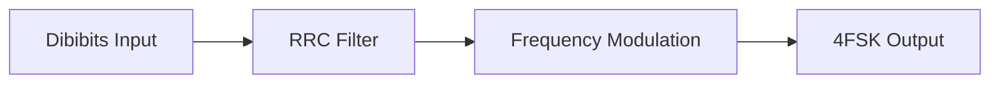
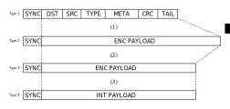

# Physical Layer

## 4FSK generation

M17 standard uses 4FSK modulation running at 4800 symbols/s (9600 bits/s) with a deviation index h=0.33 for transmission in 9 kHz channel bandwidth. Channel spacing is 12.5 kHz. The symbol stream is converted to a series of impulses which pass through a root-raised-cosine (alpha=0.5) shaping filter before frequency modulation at the transmitter and again after frequency demodulation at the receiver.



The bit-to-symbol mapping is shown in the table below.

Bit 1 | Bit 0 | Symbol | 4FSK Deviation
----- | ----- | ------ | --------------
0     | 1     | +3     | +2.4 kHz
0     | 0     | +1     | +0.8 kHz
1     | 0     | -1     | -0.8 kHz
1     | 1     | -3     | -2.4 kHz

The most significant bits are sent first, meaning that the byte 0xB4 (= 0b10’11’01’00) in type 4 bits (see Bit types) would be sent as the symbols -1 -3 +3 +1.

### Preamble

Every transmission starts with a preamble, which shall consist of at least 40 ms of alternating -3, +3… symbols. This is equivalent to 40 milliseconds of a 2400 Hz tone.

### Bit Types

The bits at different stages of the error correction coding are referred to with bit types, given in the following table.

Type   | Description
----   | -----------
Type 1 | Data link layer bits
Type 2 | Bits after appropriate encoding
Type 3 | Bits after puncturing (only for convolutionally coded data, for other ECC schemes type 3 bits are the same as type 2 bits)
Type 4 | Decorrelated and interleaved (re-ordered) type 3 bits

Type 4 bits are used for transmission over the RF. Incoming type 4 bits shall be decoded to type 1 bits, which are then used to extract all the frame fields.

### Error correction coding schemes and bit type conversion

Two distinct ECC/FEC schemes are used for different parts of the transmission.

#### Link Setup Frame



240 DST, SRC, TYPE, META and CRC type 1 bits are convolutionally coded using rate 1/2 coder with constraint K=5. 4 tail bits are used to flush the encoder’s state register, giving a total of 244 bits being encoded. Resulting 488 type 2 bits are retained for type 3 bits computation. Type 3 bits are computed by puncturing type 2 bits using a scheme shown in chapter 4.4. This results in 368 bits, which in conjunction with the synchronization burst gives 384 bits (384 bits / 9600bps = 40 ms).  
  
Interleaving type 3 bits produce type 4 bits that are ready to be transmitted. Interleaving is used to combat error bursts.

#### Subsequent Frames


A 48-bit (type 1) chunk of the LSF is partitioned into 4 12-bit parts and encoded using Golay (24, 12) code. This produces 96 encoded bits of type 2. These bits are used in the Link Information Channel (LICH).  
  
16-bit FN and 128 bits of payload (144 bits total) are convolutionally encoded in a manner analogous to that of the link setup frame. A total of 148 bits is being encoded resulting in 296 type 2 bits. These bits are punctured to generate 272 type 3 bits.  
  
96 type 2 bits of LICH are concatenated with 272 type 3 bits and re-ordered to form type 4 bits for transmission. This, along with 16-bit sync in the beginning of frame, gives a total of 384 bits.  
  
The LICH chunks allow for late listening and indepedent decoding to check destination address. The goal is to require less complexity to decode just the LICH and check if the full message should be decoded.

#### Golay (24,12)

The Golay (24,12) encoder uses generating polynomial g given below to generate the 11 check bits. The check bits and an overall parity bit are appended to the 12 bit data, resulting in a 24 bit codeword. The resulting code is systematic, meaning that the input data (message) is embedded in the codeword.

$$
\begin{align}
   g(x) =& x^{11} + x^{10} + x^6 + x^5 + x^4 + x^2 + 1
\end{align}
$$

This is equivalent to 0xC75 in hexadecimal notation. The output of the Golay encoder is shown in the table below.

Field      | Data     | Check bits  | Parity
-----      | ----     | ----------  | ------
Position   | 23..12   | 11..1       | 0 (LSB)
Length     | 12       | 11          | 1

Four of these 24-bit blocks are used to reconstruct the LSF.

#### Convolutional encoder

The convolutional code shall encode the input bit sequence after appending 4 tail bits at the end of the sequence. Rate of the coder is R=½ with constraint length K=5. The encoder diagram and generating polynomials are shown below:

$$
\begin{align}
   G_1(D) =& 1 + D^3 + D^4 \\
   G_2(D) =& 1+ D + D^2 + D^4
\end{align}
$$

The output from the encoder must be read alternately.


#### Code Puncturing

Removing some of the bits from the convolutional coder’s output is
called code puncturing. The nominal coding rate of the encoder used in
M17 is ½. This means the encoder outputs two bits for every bit of the
input data stream. To get other (higher) coding rates, a puncturing
scheme has to be used.  
  
Two different puncturing schemes are used in M17 stream mode:

1. $P_1$ leaving 46 from 61 encoded bits
2. $P_2$ leaving 11 from 12 encoded bits

Scheme $P_1$ is used for the *link setup frame*, taking 488 bits of encoded data and selecting 368 bits. The $gcd(368,488)$ is 8 which, when used to divide, leaves 46 and 61 bits. However, a full puncture pattern requires the puncturing matrix entries count to be divisible by the number of encoding polynomials. For this case a partial puncture matrix is used. It has 61 entries with 46 of them being ones and shall be used 8 times, repeatedly. The construction of the partial puncturing pattern $P_1$ is as follows:

$$
\begin{align}
    \mathbb{M} = & \begin{bmatrix}
    1 & 0 & 1 & 1
    \end{bmatrix} \\
    P_1 = & \begin{bmatrix}
    1 & \mathbb{M}_{1} & \cdots & \mathbb{M}_{15}
    \end{bmatrix}
\end{align}
$$

In which $\mathbb{M}$ is a standard 2/3 rate puncture matrix and is used 15 times, along with a leading 1 to form an array of length 61.  
  
The first pass of the partial puncturer discards $G_1$ bits only, second pass discards $G_2$, third - $G_1$ again, and so on. This ensures that both bits are punctured out evenly.  
  
Scheme $P_2$ is for frames (excluding LICH chunks, which are coded differently). This takes 296 encoded bits and selects 272 of them. Every 12th bit is being punctured out, leaving 272 bits. The full matrix shall have 12 entries with 11 being ones.  
  
The puncturing scheme $P_2$ is defined by its partial puncturing matrix:

$$
\begin{align}
   P_2 = & \begin{bmatrix}
   1 & 1 & 1 & 1 & 1 & 1 \\
   1 & 1 & 1 & 1 & 1 & 0
   \end{bmatrix}
\end{align}
$$

The linearized representations are:

```
P1 = [1, 1, 0, 1, 1, 1, 0, 1, 1, 1, 0, 1, 1, 1, 0, 1, 1,
      1, 0, 1, 1, 1, 0, 1, 1, 1, 0, 1, 1, 1, 0, 1, 1, 1,
      0, 1, 1, 1, 0, 1, 1, 1, 0, 1, 1, 1, 0, 1, 1, 1, 0,
      1, 1, 1, 0, 1, 1, 1, 0, 1, 1]

P2 = [1, 1, 1, 1, 1, 1, 1, 1, 1, 1, 1, 0]
```

#### Interleaving

For interleaving a Quadratic Permutation Polynomial (QPP) is used. The polynomial $\pi(x)=(45x+92x^2)\mod 368$ is used for a 368 bit interleaving
pattern. See Appendix for pattern.

#### Data Decorrelator

To avoid transmitting long sequences of constant symbols (e.g. 010101…), a simple algorithm is used. All 46 bytes of type 4 bits shall be XORed with a pseudorandom, predefined stream. The same algorithm has to be used for incoming bits at the receiver to get the original data stream. See Appendix for sequence.
