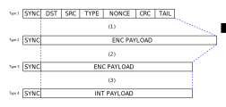
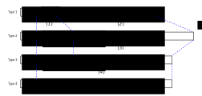

Physical Layer
==============

4FSK generation
---------------
M17 standard uses 4FSK modulation running at 4800 symbols/s (9600 bits/s) with a deviation index
h=0.33 for transmission in 6.25 kHz channel bandwidth. Channel spacing is 12.5 kHz. The symbol
stream is converted to a series of impulses which pass through a root-raised-cosine (α=0.5) shaping
filter before frequency modulation at the transmitter and again after frequency demodulation at the
receiver.

.. graph:: modulation
   :alt: RRC filter and Frequency Modulation
   :caption: 4FSK modulator dataflow

   rankdir="LR"
   src [shape=none, label=""]
   out [shape=none, label=""]
   "RRC Filter"[shape=box]
   "Frequency Modulation"[shape=box]
   
   src -- "RRC Filter" [label="Dibits Input"]
   "RRC Filter" -- "Frequency Modulation"
   "Frequency Modulation" -- out [label="4FSK output"]

The bit-to-symbol mapping is shown in the table below.

.. table:: Dibit symbol mapping to 4FSK deviation
   
   +-------------------------------+---------------+---------------+
   |Information bits               |Symbol         |4FSK deviation |
   +---------------+---------------+               |               |
   |Bit 1          | Bit 0         |               |               |
   +---------------+---------------+---------------+---------------+
   |0              |1              |+3             |+2.4 kHz       |
   +---------------+---------------+---------------+---------------+
   |0              |0              |+1             |+0.8 kHz       |
   +---------------+---------------+---------------+---------------+
   |1              |0              |-1             |-0.8 kHz       |
   +---------------+---------------+---------------+---------------+
   |1              |1              |-3             |-2.4 kHz       |
   +---------------+---------------+---------------+---------------+

.. todo:: update section

The most significant bits are sent first, meaning that the byte 0xB4
in type 4 bits (see section 3) would be sent as the symbols -1 -3 +3
+1.

Preamble
--------

Every transmission starts with a preamble, which shall consist of at
least 40ms of alternating -3, +3... symbols. This is equivalent to 40
milliseconds of a 2400 Hz tone

Bit types
---------

The bits at different stages of the error correction coding are
referred to with bit types, given in Table 2.

.. table:: Bit types

+---------------+----------------------------------------+
|Type 1         |Data link layer bits                    |
+---------------+----------------------------------------+
|Type 2         |Bits after appropriate encoding         |
+---------------+----------------------------------------+
|Type 3         |Bits after puncturing (only for         |
|               |convolutionally coded data, for other   |
|               |ECC schemes type 3 bits are the same as |
|               |type 2 bits)                            |
+---------------+----------------------------------------+
|Type 4         |Whitened and interleaved (re-ordered)   |
|               |type 3 bits                             |
+---------------+----------------------------------------+
           
Type 4 bits are used for transmission over the RF. Incoming type 4
bits shall be decoded to type 1 bits, which are then used to extract
all the frame fields.

Error correction coding schemes and bit type conversion
-------------------------------------------------------
Two distinct ECC schemes are used for different parts of the transmission.

   
Link setup frame
~~~~~~~~~~~~~~~~

   ECC stages for the link setup frame

240 DST, SRC, TYPE, NONCE and CRC type 1 bits are convolutionally
coded using rate 1/2 coder with constraint K=5. 4 tail bits are used
to flush the encoder's state register, giving a total of 244 bits
being encoded. Resulting 488 type 2 bits are retained for type 3 bits
computation. Type 3 bits are computed by puncturing type 2 bits using
a scheme shown in chapter 4.4. This results in 368 bits, which in
conjunction with the synchronization burst gives 384 bits (384 bits /
9600bps = 40 ms).

Interleaving type 3 bits produce type 4 bits that are ready to be
transmitted. Interleaving is used to combat error bursts.

Subsequent frames
~~~~~~~~~~~~~~~~~

   ECC stages of subsequent frames

A 48-bit (type 1) chunk of LICH is partitioned into 4 12-bit parts and
encoded using Golay (24, 12) code. This produces 96 encoded LICH bits
of type 2.

164 FN, payload and CRC bits are convolutionally encoded in a manner
analogous to that of the link setup frame. A total of 168 bits is
being encoded resulting in 336 type 2 bits. These bits are punctured
to generate 272 type 3 bits.

96 type 2 bits of LICH are concatenated with 272 type 3 bits and
re-ordered to form type 4 bits for transmission. This, along with
16-bit sync in the beginning of frame, gives a total of 384 bits

Convolutional encoder
~~~~~~~~~~~~~~~~~~~~~

The convolutional code shall encode the input bit sequence after
appending 4 tail bits at the end of the sequence. Rate of the coder is
R=½ with constraint length K=5. The encoder diagram and generating
polynomials are shown below

.. math::

   \begin{eqnarray}
   G_1(D) =& 1 + D^3 + D^4\\
   G_2(D) =& 1+ D + D^2 + D^4
   \end{eqnarray}

The output from the encoder must be read alternately.

   Convolutional coder diagram

Code puncturing
~~~~~~~~~~~~~~~

Removing some of the bits from the convolutional coder’s output is
called code puncturing. The nominal coding rate of the encoder used in
M17 is ½. This means the encoder ouputs two bits for every bit of the
input data stream. To get other (higher) coding rates, a puncturing
scheme has to be used.

Two different puncturing schemes are used in M17:

#. leaving 46 from 61 encoded bits
#. leaving 34 from 41 encoded bits
   
Both puncturers are defined by their puncturing matrices:

.. math::

   \begin{eqnarray}
   P1 =& \begin{pmatrix}
   1 & 1 & 1 & 0 & 1 & 1 & 0 & 1 & 1 & 1 & 1 & 0 & 1 & 1 & 0 & 1 & 1 & 1 & 1 & 0 & 1 & 1 & 0 & 1 & 1 & 1 & 1 & 0 & 1 & 1 & 1 \\
   1 & 0 & 1 & 1 & 0 & 1 & 1 & 1 & 1 & 0 & 1 & 1 & 0 & 1 & 1 & 1 & 1 & 0 & 1 & 1 & 0 & 1 & 1 & 1 & 1 & 0 & 1 & 1 & 0 & 1 & X \\
   \end{pmatrix} \\
   P2 =& \begin{pmatrix}
   1 & 1 & 1 & 1 & 1 & 1 & 1 & 1 & 1 & 1 & 0 & 1 & 1 & 1 & 1 & 1 & 1 & 1 & 1 & 1 & 1 \\
   1 & 1 & 0 & 1 & 1 & 0 & 1 & 1 & 0 & 1 & 1 & 0 & 1 & 1 & 0 & 1 & 1 & 0 & 1 & 1 & X \\
   \end{pmatrix}
   \end{eqnarray}
   
Scheme I is used for the initial LICH link setup info, while scheme II
is for frames (excluding LICH chunks, which are coded differently).

.. todo:: explain what’s the X for

Data Whitening
~~~~~~~~~~~~~~

To avoid transmitting long sequences of constant symbols
(e.g. 010101…), a simple data whitening algorithm is used. All 46
bytes of type 4 bits shall be XORed with a pseudorandom, predefined
stream1 .  The same algorithm has to be used for incoming bits at the
receiver to get the original data stream.

.. todo:: add diagram
